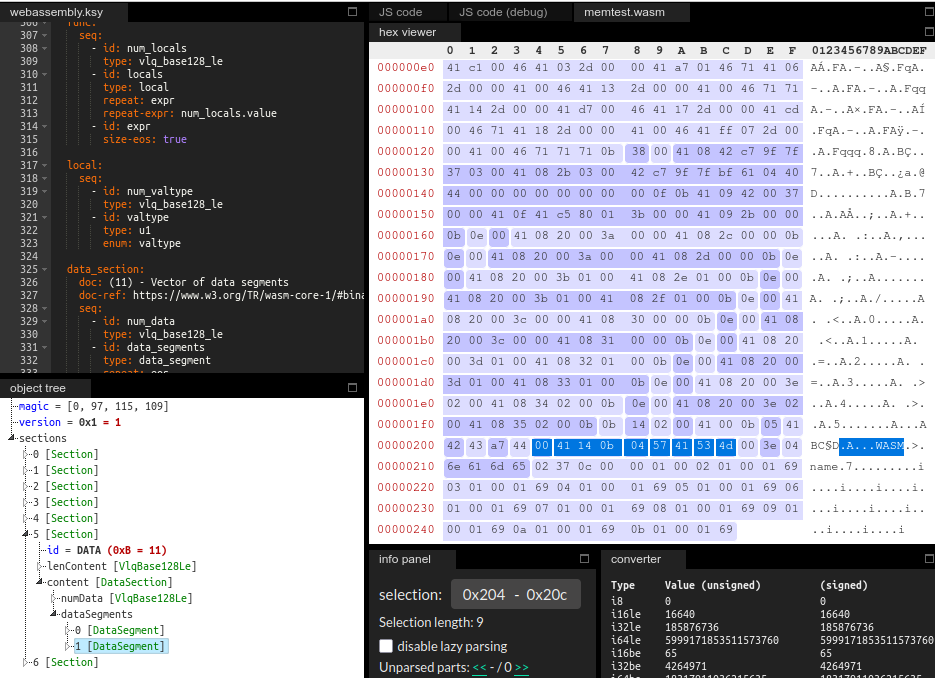

# wasm-kaitai-struct

A [Kaitai Struct](https://kaitai.io) definition for [WebAssembly](https://webassembly.org/) binary files.

The goal of this repository is to provide a convenient way to work with WebAssembly modules in their binary format by providing a Kaitai Struct definition. This definition can then be used to quickly develop a parser in a multitude of target languages using the Kaitai Struct Compiler.

For a quick inspection of WebAssembly files the schema definition in this repository can be used in the [Kaitai Web IDE](https://ide.kaitai.io/).

Target audience and possible applications are 

- Security researchers that want to dissect WebAssembly files.
- Verification of compiler outputs.
- Developers that want to implement their own WebAssembly runtime.
- Students that want to learn about the structure and format of WebAssembly binary files.

## Feature Overview

- Supports Wasm 1.0 according to [WebAssembly Core Specification — W3C Recommendation, 5 December 2019](https://www.w3.org/TR/wasm-core-1)
- Naming as close as possible to the WebAssembly Specification
- As permissive as possible to allow parsing of uncommon files
- Cross-references to the specific chapters of the specification
- Follows the [KSY Style Guide](https://doc.kaitai.io/ksy_style_guide.html)

## Feature Roadmap

- Compile to all target languages in CI
- Run against a set of sample wasm-files
- Unit-tests
- Demo application
- Definition for Wasm 2.0 and Wasm 3.0
- Definitions for common custom sections

## Bug Reports

Please create an issue if you notice something does not work as expected or you think the WebAssembly Core Specification is violated. Do also provide the wasm-file and other reference information.

## Background

There are currently two other versions of Kaitai Struct definitions for WebAssembly binary files I could find on the internet: [sophoslabs/WebAssembly](https://github.com/sophoslabs/WebAssembly) and [evacchi/kaitai-webassembly](https://github.com/evacchi/kaitai-webassembly) which is a fork of the first with some extensions. Both work well in most scenarios but do not support all elements of a WebAssembly module according to the official specification and I find their naming and structure difficult to work with. 

For these reasons I created a new Kaitai Struct definition from scratch using only the official specification as reference and the [Kaitai Web IDE](https://ide.kaitai.io/) for testing. This resulted in a 25% smaller (lines) schema file while being fully compliant with the WebAssembly specification.

## References

- [WebAssembly Core Specification — W3C Recommendation, 5 December 2019](https://www.w3.org/TR/wasm-core-1)
- [Kaitai Struct User Guide](https://doc.kaitai.io/user_guide.html)
- [KSY Style Guide](https://doc.kaitai.io/ksy_style_guide.html)